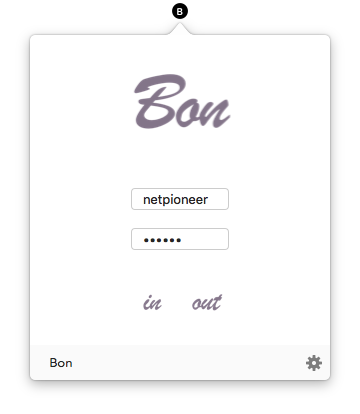
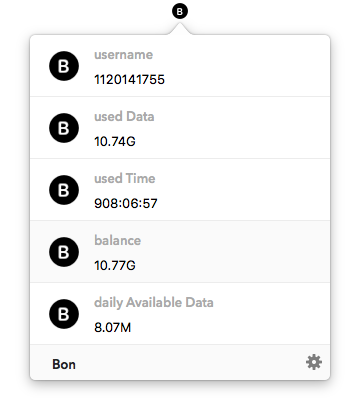

# Bon for Mac:

> Elegant network client for [BIT](http://www.bit.edu.cn)

## Screenshots

## Downloads

- [0.3.5 beta](https://github.com/Chriskuei/Bon-for-Mac/releases/download/v0.3.5/Bon.app.zip)
- [0.4.0 beta](https://github.com/Chriskuei/Bon-for-Mac/releases/download/v0.4.0/Bon.app.zip)

## Features

- [x] Login & Logout
- [x] Used data
- [x] Used time
- [x] User balance
- [x] Predict daily available data in the rest of current month

## Todo

- [ ] Pull to refresh
- [ ] Support self service
- [ ] Start on Mac star up

## Requirements

- Swift 3.0+
- Xcode 8.0
- OS X 10.11+

## FAQ

### What's the origin of the name Bon?

Bon stands for BIT Online, a elegant network client for BIT.

---

## Acknowledgements

- [Alamofire](https://github.com/Alamofire/Alamofire)
- [Gank-for-Mac](https://github.com/hujiaweibujidao/Gank-for-Mac)

## Contribution

- If you need help or you'd like to ask a general question, open an issue.
- If you found a bug, open an issue.
- If you have a feature request, open an issue.
- If you want to contribute, submit a pull request.

## Credits

Bon is owned and maintained by [Chriskuei](http://github.com/chriskuei). You can follow him on Weibo at [@我叫陈陈陈大鬼](https://weibo.com/chenjiangui) for project updates and releases.

## License

Bon is released under the MIT license. See [LICENSE](LICENSE) for details.
